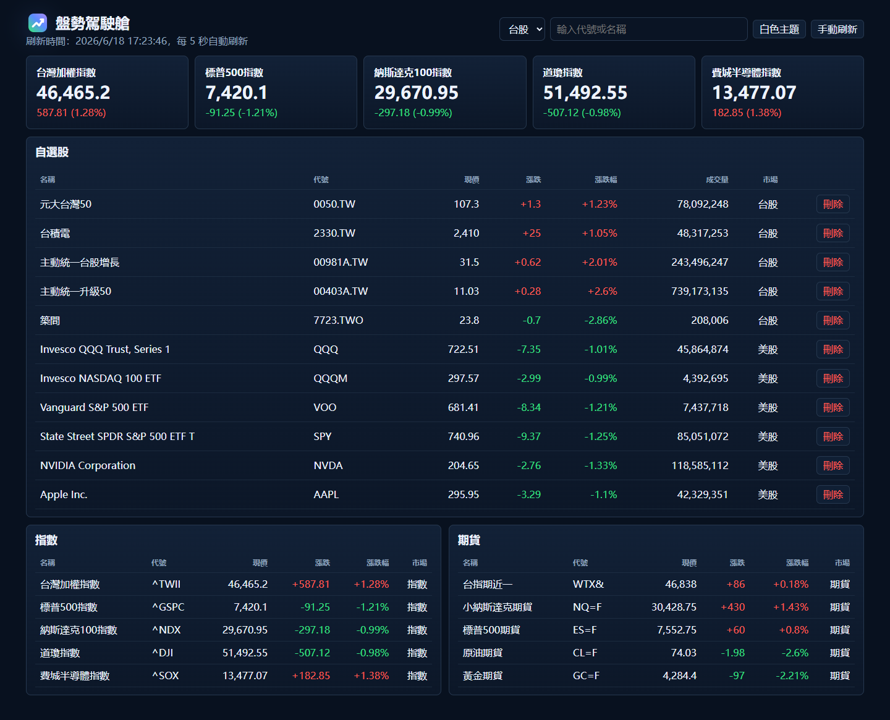

# MarketView

本機使用的輕量股票看盤工具。  
不需要註冊、不需要資料庫、不需要 `npm install`，設定都放在 `config.json`。



## 功能

- 台股 / 美股搜尋，並可加入自選股
- 自選股支援拖曳排序，排序會寫回 `config.json`
- 台股、美股、指數、期貨分組看盤
- 自動刷新，也可以手動刷新
- 深色 / 白色主題切換，瀏覽器會記住選擇
- 點擊股票可開啟詳情視窗
- 詳情支援日 K、週 K、月 K、分時線
- K 線支援 MA5、MA10、MA20、MA60
- 分時線支援昨收基準線、成交量、最高 / 最低標記與 hover 提示

## 需要的環境

- Git
- Node.js 18 或更新版本
- Chrome、Edge、Firefox 等瀏覽器

確認 Node.js 是否可用：

```bat
node -v
```

## Windows 啟動

雙擊：

```text
start.bat
```

或在命令列執行：

```bat
start.bat
```

啟動後打開：

```text
http://localhost:8000/
```

## Windows 停止

雙擊：

```text
stop.bat
```

或在命令列執行：

```bat
stop.bat
```

## 手動啟動

不使用批次檔時，也可以直接執行：

```bat
node server.js
```

如果要改用其他 port：

```bat
set PORT=8080
node server.js
```

然後打開：

```text
http://localhost:8080/
```

## 設定自選股、指數與期貨

主要設定檔是：

```text
config.json
```

基本格式：

```json
{
  "refreshSeconds": 5,
  "groups": [
    {
      "name": "自選股",
      "symbols": [
        { "symbol": "0050.TW", "name": "元大台灣50", "type": "台股" },
        { "symbol": "QQQ", "name": "Invesco QQQ Trust, Series 1", "type": "美股" }
      ]
    }
  ]
}
```

常見代號格式：

- 台股上市：`2330.TW`
- 台股上櫃：`7723.TWO`
- 美股：`AAPL`、`VOO`、`QQQ`
- 指數：`^TWII`、`^GSPC`、`^NDX`、`^DJI`、`^SOX`
- 國際期貨：`NQ=F`、`ES=F`、`CL=F`、`GC=F`
- 台灣期貨：`WTX&` 等 Yahoo 台灣期貨代號

也可以直接在頁面搜尋股票後加入自選股。

## 專案結構

```text
server.js              本機 HTTP server 與 API routes
config.js              config.json 讀寫與自選股操作
config.json            本機設定、自選股、指數與期貨清單
public/index.html      前端 HTML
public/style.css       前端樣式
public/app.js          前端互動與圖表
services/yahoo.js      Yahoo Finance 行情、搜尋與詳情資料
services/twse.js       TWSE / TPEx 台股代號與名稱查詢
start.bat              Windows 啟動腳本
stop.bat               Windows 停止腳本
```

## 自我檢查

可以執行內建 self-test，確認行情、搜尋與詳情 API 是否正常：

```bat
node server.js --self-test
```

成功時會看到類似：

```text
ok: 21 quotes, detail 245 days
```

## 注意

行情資料來源主要是 Yahoo Finance 與公開資料端點，可能延遲、缺漏或暫時失敗。  
這個工具適合個人看盤參考，不適合作為正式交易或專業報價系統。

目前專案刻意保持簡單：沒有登入、沒有資料庫、沒有公開部署安全設計。建議只在本機或私人環境使用。
